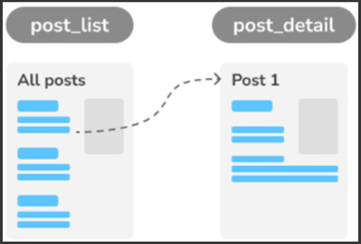
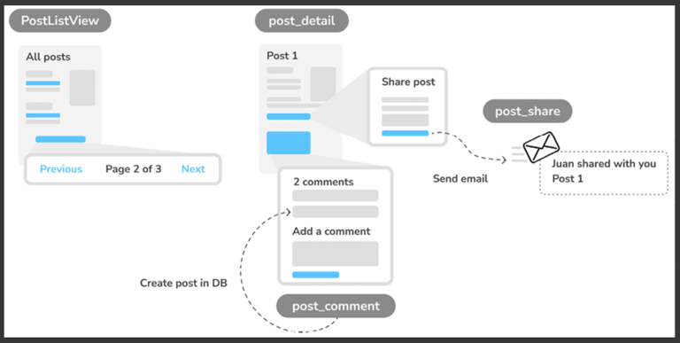
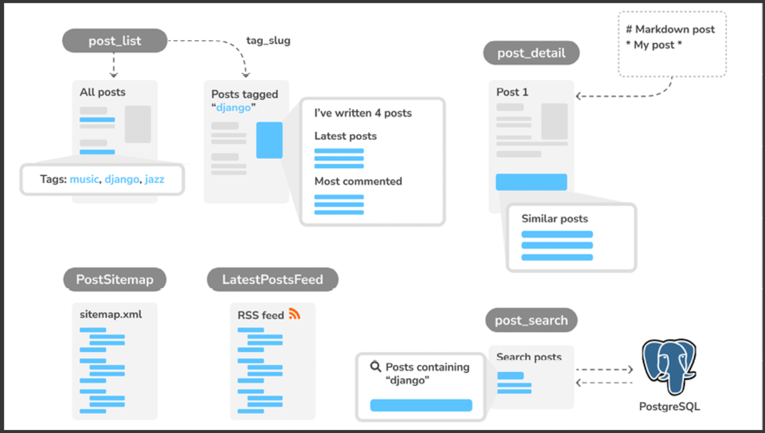
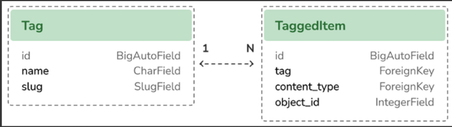
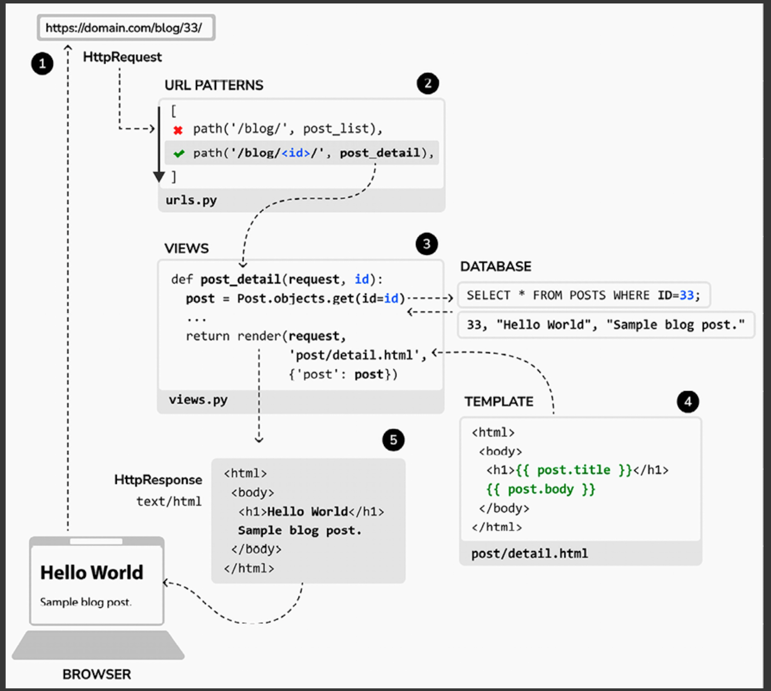

# Blog Application

A minimal Django project you can use as a starter: clean settings, sane defaults, and the usual dev tasks (run server, migrations, tests).

Steps:

* [x] Installing Python
* [x] Creating a Python virtual environment
* [x] Installing Django
* [x] Creating and configuring a Django project
* [x] Building a Django application
* [x] Designing data models
* [x] Creating and applying model migrations
* [x] Setting up an administration site for your models
* [x] Working with QuerySets and model managers
* [x] Building views, templates, and URLs
* [x] Understanding the Django request/response cycle
* [x] Using canonical URLs for models
* [x] Creating SEO-friendly URLs for posts
* [x] Adding pagination to the post list view
* [x] Building class-based views
* [x] Sending emails with Django
* [x] Using Django forms to share posts via email
* [x] Adding comments to posts using forms from models
* [x] Implementing tagging using django-taggit
* [x] Retrieving posts by similarity
* [x] Creating custom template tags and filters to display the latest posts and most commented posts
* [x] Adding a sitemap to the site
* [x] Creating feeds for blog posts
* [x] Installing PostgreSQL
* [x] Using fixtures to dump and load data into the database
* [x] Implementing a full-text search engine with Django and PostgreSQL


## Requirements
- Python 3.11+ (3.12 recommended)
- pip or uv / pipenv / poetry (pick your favorite)
- Git

---

## Quick Start

```bash
# 1) Virtual env
python -m venv .venv
source .venv/bin/activate  # Windows: .venv\Scripts\activate

# 2) Install deps
pip install -U pip wheel
pip install -r requirements.txt  # or `pip install -e .` if using a pyproject

# 3) Environment variables
cp .env.example .env

# 4) DB + superuser
docker pull postgres:latest

docker run --name=blog_db \
  -e POSTGRES_DB=blog \
  -e POSTGRES_USER=blog \
  -e POSTGRES_PASSWORD=xxxxx \
  -p 5432:5432 \
  -d postgres

cd mysite
python manage.py migrate
python manage.py createsuperuser

# 5) Run
python manage.py runserver
```







