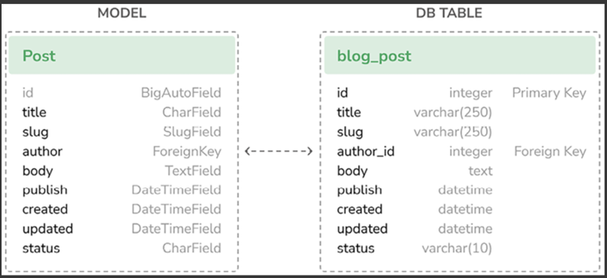

# Blog Application

A minimal Django project you can use as a starter: clean settings, sane defaults, and the usual dev tasks (run server, migrations, tests).


## Requirements
- Python 3.11+ (3.12 recommended)
- pip or uv / pipenv / poetry (pick your favorite)
- Git

---

## Quick Start

```bash
# 1) Virtual env
python -m venv .venv
source .venv/bin/activate  # Windows: .venv\Scripts\activate

# 2) Install deps
pip install -U pip wheel
pip install -r requirements.txt  # or `pip install -e .` if using a pyproject

# 3) Environment variables
cp .env.example .env

# 4) DB + superuser
cd mysite
python manage.py migrate
python manage.py createsuperuser

# 5) Run
python manage.py runserver
```



